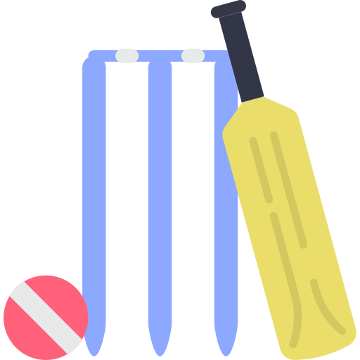
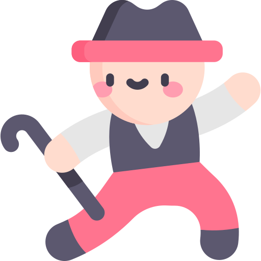

<h1> Hey! Nice to see you </h1>

 

<h1>Hobbies</h1>

    
   
   __
   
  __
   
   __
   
   __
   
   __
   __
   __
   
   

 
<h1>Certifications</h1>

    
    
     
    
      
       
      
     
     
    

<!-- * 🌐 You can see some of my projects on [my portfolio]() -->

 

<h1>⚡ Things I code with</h1>

   
   
  
  
  
      

  
   
  
  
  
  
  
   
  
   
   

  

 

<h3 align="center" color="red" border="1px solid white">  “Website without visitors is like a ship lost in the horizon.” - Dr. Christopher Dayagdag </h3>
 

<!-- snake -->
<!--
-->

<!--
**anujgiri20/anujgiri20** is a ✨ _special_ ✨ repository because its `README.md` (this file) appears on your GitHub profile.

Here are some ideas to get you started:

- 🔭 I’m currently working on ...
- 🌱 I’m currently learning ...
- 👯 I’m looking to collaborate on ...
- 🤔 I’m looking for help with ...
- 💬 Ask me about ...
- 📫 How to reach me: ...
- 😄 Pronouns: ...
- ⚡ Fun fact: ...
-->
